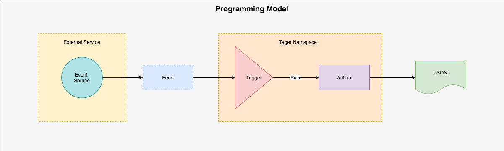
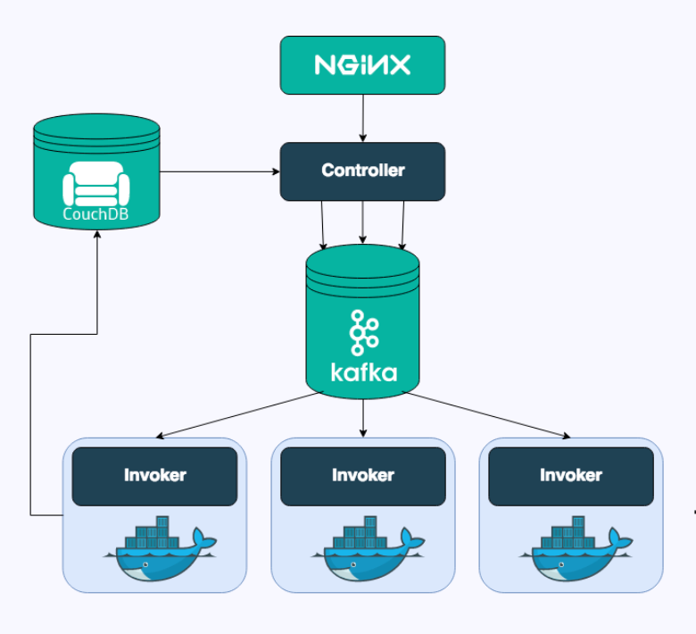

# Apache OpenWhisk (Serverless )
## OpenSource Serverless cloud platform for Private Cloud / Data Centers
## What is FaaS or Serverless ?
It is the ability to write code for the application in small <i>atomic</i> chunks, without having to bind them with a web-server or even worry about the web-server.

Imagine, in NodeJs I need to build an API that accepts principal, rate of interest and time (in years) and return Simple Interest. 

- To make that available: 
    - I'll setup a server (For eg. Express).
    - I'll pick a particular URL path and method.
    - Setup the code to get the Simple Interest.

In Serverless, all I need is to write the business logic to calculate the Simple Interest.

- The framework will itself handle 
    - All the logic to expose the API.
    - Setting up the path and method.
    - Exposing the same logic to be shared with other logic as well.
    
<b>Essentially, this means as a developer I'm just focused on writing the business logic and need not to worry about stuff around it to make it available.</b>     

## Benefits of FaaS or Serverless
- Promotes single responsibility principle.
- Zero efforts on server management.
- Serverless architectures are inherently scalable.
- Cross cutting concerns like security, IAM, API Gateway, Traffic management, Recovery, Observability, logging and monitoring etc. are already managed.
- Patching, Fixing, Updating and Deployment of code is faster than never before.
- Code does not execute on origin server. Serverless has ability to execute code on the data center that are available closer to the end user, thus decrease latency. 

## Disadvantages of FaaS or Serverless
- Testing and debugging become more challenging.
- It is the responsibility of Developer to mask sensitive information.
- Cost expensive models like pay-per-consumption or pay-per-request may lead to budget issues, because Public cloud provide charge for the amount of time running the code. But I don't see any cost issue when executing serverless in Private cloud or a Data center.
- Because the application code is not constantly running, serverless may need to 'boot up' the code when call to the function is made. This can cause performance delay.
  But serverless queues all the requests as 'cold start' and return the response when the server is available to cater them. 
- In case of Public cloud, managed serverless services (eg. AWS Lambda, Google cloud function or Azure functions etc.) will lead to vendor lock-in. 
  In case of data center or private cloud, one can setup serverless frameworks like OpenWhisk, Knative, Fn Project. etc on bare-metal. These frameworks provide hybrid compatibility with Public cloud as well.
  
## Introduction to OpenWhisk
   Apache OpenWhisk is an open source, distributed Serverless platform that executes functions (fx) in response to events at any scale. The OpenWhisk platform supports a programming model in which developers write functional logic (called <b>Actions</b>), in any supported programming language, that can be dynamically scheduled and run in response to associated events (via <b>Triggers</b>) from external sources (<b>Feeds</b>) or from HTTP requests.

## Programming Model

### Actions
- Actions are the atomic units that encapsulate application logic and execute it in response to events. Actions can be invoked by OpenWhisk REST API, OpenWhisk CLI, User defined APIs or triggers.
#### Sequence
- Series of actions (may be written in different programming languages) composed together to create a longer processing pipeline is called a Sequence.
### Triggers
- Named channel for classes or events sent from Event Source.
### Rules
- Rules are used to provide 1-to-1 mapping between a trigger and an action. It lays down a complaince that an action is invoked on firing of the trigger.
### Event Sources
- Messaging Queues
- Database Changes
- Change in document store
- Web interaction
- Invocation of service API
- IoT frameworks forwading sensor data
- etc.    

## OpenWhisk setup
### Supported Platforms
- Kubernetes
  - For this demo I'm using Minikube (1.11.0). Upgrade minikube version from 1.5.0 to 1.11.0 (because storage provisioner was failing in previous versions).
  - Start minikube with "hyperkit" driver. In case if you are using MacOs. HyperKit is an open-source hypervisor for macOS hypervisor, optimized for lightweight virtual machines and container deployment.
  - In case of Linux start minikube with "kvm2" driver.
- Openshift
- Apache Mesos
- Docker Compose
- IBM Bluemix (IBM Cloud Functions)
### Supported Languages
- NodeJS, Go, Java, Scala, PHP, Python, Ruby, Swift, Ballerina, .Net and Rust
### Helm 3
- Streamlines installing and managing Kubernetes applications
- Helm 3 is used that eliminate the provisioning of tiller (earlier required in Helm2).            
### OpenWhisk CLI (wsk)
- Download OpenWhisk CLI for your Operating System from 'https://github.com/apache/openwhisk-cli/releases'
- sudo mv [full path to downloaded wsk executable] /usr/local/bin/wsk
- Verify `wsk --help`
### Whisk Deploy (wskdeploy)
- Whisk Deploy is a utility, named wskdeploy, to help deploy and manage all your OpenWhisk Packages, Actions, Triggers, Rules and APIs using a single command using an application manifest.
- Download the Whisk Deploy utility for your Operating System from 'https://github.com/apache/openwhisk-wskdeploy/releases'
- sudo mv [full path to downloaded wsk executable] /usr/local/bin/wskdeploy
### Configuration steps
- `kubectl create namespace openwhisk`
- `kubectl label nodes --all openwhisk-role=invoker (label kubernetes worker nodes)`
- `git clone https://github.com/apache/openwhisk-deploy-kube.git  && cd openwhisk-deploy-kube `
- replace the value of "api_host_name" key under "whisk_ingress" with $(minikube ip) in 'helm/openwhisk/values.yaml' file
- `helm install helm/openwhisk/`
- `wsk property set --apihost $(minikube ip):31001 --auth 23bc46b1-71f6-4ed5-8c54-816aa4f8c502:123zO3xZCLrMN6v2BKK1dXYFpXlPkccOFqm12CdAsMgRU4VrNZ9lyGVCGuMDGIwP`
- verify `wsk list -i`
## Components of OpenWhisk / How it works ?

### Nginx
- The first entry point into the system is through nginx, “an HTTP and reverse proxy server”. It is mainly used for SSL termination and forwarding appropriate HTTP calls to the next component.
### Controller
- It is a Scala-based implementation of the actual REST API (based on Akka and Spray) and thus serves as the interface for everything a user can do, including CRUD requests for your entities in OpenWhisk and invocation of actions.
### CouchDB
- Controller verifies who you are (Authentication) and if you have the privilege to do what you want to do with that entity (Authorization). The credentials included in the request are verified against the so-called subjects database in a CouchDB instance.
- Controller is now sure the user is allowed in and has the privileges to invoke his action, it actually loads this action from the whisks database in CouchDB.
### Load Balancer
- The Load Balancer, knowing which Invokers are available, chooses one of them to invoke the action requested.
### Kafka
- The Controller publishes a message to Kafka, which contains the action to invoke and the parameters to pass to that action.
- Once Kafka has confirmed that it got the message, the HTTP request to the user is responded to with an ActivationId. The user will use that later on, to get access to the results of this specific invocation.
### Invoker
- The Invoker is the heart of OpenWhisk. The Invoker’s duty is to invoke an action. It is also implemented in Scala. But there’s much more to it. To execute actions in an isolated and safe way it uses Docker.
- For each action invocation a Docker container is spawned, the action code gets injected, it gets executed using the parameters passed to it, the result is obtained, the container gets destroyed.     

## Simple Interest Application
- I've created a NodeJs based Simple interest calculator. 
  - It contains series of actions. 
    - f(x) to accept input.
    - f(x) to calculate interest.
    - f(x) to calculate amount.
  - It contains a `manifest.yaml` file that act as a deployment descriptor for OpenWhisk.  
- Check out the code from 'https://github.com/rajat965ng/OpenWhisk.git'
- cd sequence/ and follow README.md

## Benefits of using OpenWhisk
- You are not tied to any provider. Officially IBM Bluemix is available.
- Can write functions in any language.
- Plug-in support for almost all kinda services.
- OpenSource community. Regular updates and bug fixes.

## Alternatives of OpenWhisk
- Public Cloud 
  - AWS Lambda
  - Google Cloud Function
  - Azure Function
- Data Center
  - Kubless
  - Knative
  - Fn Project

## Conclusion
- Going serverless is not only about technical updates but also requires a shift in mindset.
- For many companies running on legacy infrastructure, migration to serverless archicture can be really painful and costly.
- With the available technology FaaS will reach the plateau of productivity in next few years, along with ML, IoT etc.
- Those who will fail to adopt the rapid changing mindset will bear the price of large adoption gap. 

## Reference
- https://openwhisk.apache.org/
- [wskdeploy utility by example]
    - https://github.com/apache/openwhisk-wskdeploy/blob/master/docs/programming_guide.md#wskdeploy-utility-by-example
- [Working with OpenWhisk - Part 1 - Getting Started]
    - https://www.youtube.com/watch?v=RHzQf5eoAwc&t=5s    